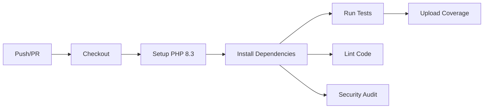
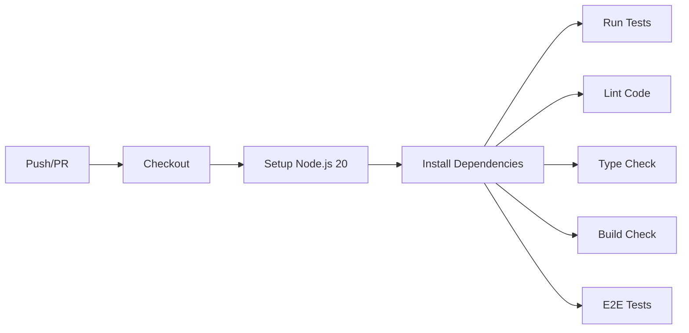

# 🚀 CI/CD Guide - RentHub

## Overview

Complete CI/CD pipeline implementation using GitHub Actions with automated testing, building, security scanning, and deployment strategies including rolling updates, blue-green, and canary deployments.

## 📋 Table of Contents

- [Workflows](#workflows)
- [Setup](#setup)
- [CI Pipeline](#ci-pipeline)
- [CD Pipeline](#cd-pipeline)
- [Deployment Strategies](#deployment-strategies)
- [Security Scanning](#security-scanning)
- [Monitoring](#monitoring)

## 🔄 Workflows

### CI Workflows

1. **Backend CI** (`.github/workflows/ci-backend.yml`)
   - Run tests with coverage
   - Code linting (Laravel Pint)
   - Static analysis (PHPStan, Psalm)
   - Security audit

2. **Frontend CI** (`.github/workflows/ci-frontend.yml`)
   - Run Jest tests
   - ESLint checking
   - TypeScript validation
   - Build verification
   - E2E tests (Playwright)

### CD Workflows

3. **Build & Push** (`.github/workflows/build-push.yml`)
   - Build Docker images
   - Push to GitHub Container Registry
   - Security scanning (Trivy)
   - Multi-platform builds

4. **Deploy Staging** (`.github/workflows/deploy-staging.yml`)
   - Automatic deployment to staging on `develop` branch
   - Database migrations
   - Smoke tests
   - Slack notifications

5. **Deploy Production** (`.github/workflows/deploy-production.yml`)
   - Manual approval required
   - Rolling updates (default)
   - Blue-green deployment (optional)
   - Canary deployment (optional)
   - Automatic rollback on failure

### Security Workflows

6. **Security Scan** (`.github/workflows/security-scan.yml`)
   - Dependency scanning (Snyk)
   - Code security (CodeQL)
   - Secrets detection (Gitleaks)
   - Container scanning (Trivy, Grype)
   - SAST analysis (Semgrep)
   - Infrastructure scanning (Checkov, Terrascan)
   - Compliance checks (kubesec, kube-score)

### Monitoring Workflow

7. **Monitoring Setup** (`.github/workflows/monitoring-setup.yml`)
   - Deploy Prometheus stack
   - Deploy Loki for logs
   - Configure AlertManager
   - Setup Grafana dashboards

## 🛠️ Setup

### 1. GitHub Secrets

Add these secrets to your GitHub repository:

**Kubernetes Access:**
```
KUBE_CONFIG_STAGING    # Base64 encoded kubeconfig for staging
KUBE_CONFIG_PROD       # Base64 encoded kubeconfig for production
```

**Container Registry:**
```
GHCR_TOKEN            # GitHub Container Registry token (auto-provided)
```

**Security Scanning:**
```
SNYK_TOKEN            # Snyk API token
GITLEAKS_LICENSE      # Gitleaks license (if using pro)
```

**Notifications:**
```
SLACK_WEBHOOK         # Slack webhook URL for notifications
```

**Monitoring:**
```
GRAFANA_PASSWORD      # Grafana admin password
PAGERDUTY_SERVICE_KEY # PagerDuty integration key
SMTP_USERNAME         # Email notifications username
SMTP_PASSWORD         # Email notifications password
```

### 2. Generate Kubeconfig

```bash
# Export kubeconfig
kubectl config view --raw --minify > kubeconfig.yaml

# Base64 encode
cat kubeconfig.yaml | base64 -w 0

# Add to GitHub Secrets
```

### 3. Enable GitHub Actions

1. Go to repository Settings → Actions → General
2. Allow all actions and reusable workflows
3. Enable workflow permissions (read and write)

## 🔍 CI Pipeline

### Backend CI Pipeline



**Triggers:**
- Push to `main` or `develop`
- Pull request to `main` or `develop`
- Changes in `backend/` directory

**Steps:**
1. Setup PHP 8.3 with extensions
2. Cache Composer dependencies
3. Install dependencies
4. Run database migrations
5. Execute tests with coverage (min 70%)
6. Run Laravel Pint (code style)
7. Run PHPStan & Psalm (static analysis)
8. Security audit with Composer

### Frontend CI Pipeline



**Triggers:**
- Push to `main` or `develop`
- Pull request to `main` or `develop`
- Changes in `frontend/` directory

**Steps:**
1. Setup Node.js 20
2. Cache npm dependencies
3. Install dependencies
4. Run Jest tests with coverage
5. Run ESLint
6. TypeScript type checking
7. Build application
8. Run Playwright E2E tests

## 🚢 CD Pipeline

### Build & Push Pipeline

**Triggers:**
- Push to `main` or `develop`
- Version tags (`v*`)
- Manual dispatch

**Process:**
1. Checkout code
2. Setup Docker Buildx
3. Login to GHCR
4. Extract metadata (tags, labels)
5. Build multi-stage images
6. Push to registry
7. Scan with Trivy
8. Upload security results

**Image Tags:**
- `latest` - from main branch
- `develop` - from develop branch
- `v1.0.0` - from version tags
- `main-abc123` - commit SHA
- `pr-123` - from pull requests

### Deployment Pipeline

#### Staging Deployment

**Trigger:** Push to `develop` branch

**Process:**
1. Checkout code
2. Configure kubectl for staging
3. Update image tags with commit SHA
4. Apply Kubernetes manifests
5. Wait for rollout completion
6. Run database migrations
7. Verify deployment
8. Run smoke tests
9. Notify on Slack

#### Production Deployment

**Trigger:** 
- Version tag push (`v*`)
- Manual workflow dispatch

**Process:**
1. Manual approval required
2. Checkout code
3. Configure kubectl for production
4. Choose deployment strategy:
   - Rolling update (default)
   - Blue-green
   - Canary
5. Deploy with chosen strategy
6. Health checks & verification
7. Automatic rollback on failure
8. Notify team

## 📊 Deployment Strategies

### 1. Rolling Update (Default)

**Use Case:** Standard deployments with minimal risk

```yaml
strategy:
  type: RollingUpdate
  rollingUpdate:
    maxSurge: 1
    maxUnavailable: 0
```

**Process:**
1. Deploy new version gradually
2. One pod at a time
3. Zero downtime
4. Automatic rollback on failure

**Command:**
```bash
kubectl apply -k k8s/overlays/production/
```

### 2. Blue-Green Deployment

**Use Case:** Instant rollback capability, A/B testing

**Process:**
1. Determine current environment (blue/green)
2. Deploy to inactive environment
3. Run tests on inactive environment
4. Switch traffic to new environment
5. Keep old environment for quick rollback

**Command:**
```bash
# Deploy
./scripts/deploy-blue-green.sh production v1.0.0

# Rollback (if needed)
./scripts/rollback-blue-green.sh production
```

**Workflow:**
```yaml
deployment_strategy: blue-green
```

### 3. Canary Deployment

**Use Case:** Gradual rollout, risk mitigation

**Process:**
1. Deploy canary with 10% traffic
2. Monitor metrics for 5 minutes
3. If metrics good, increase to 50%
4. Monitor again
5. Full rollout if successful
6. Automatic rollback if metrics bad

**Traffic Split:**
- Phase 1: 10% canary, 90% stable (5 min)
- Phase 2: 50% canary, 50% stable (5 min)
- Phase 3: 100% canary

**Metrics Monitored:**
- Error rate (<1%)
- Response time (p95 <1s)
- CPU/Memory usage

**Command:**
```bash
# Deploy canary
./scripts/deploy-canary.sh production v1.0.0

# Monitor
kubectl get deployment backend-canary -n renthub -w

# Promote or rollback
./scripts/promote-canary.sh production
./scripts/rollback-canary.sh production
```

## 🔒 Security Scanning

### Automated Security Checks

**Frequency:**
- On every push/PR
- Daily scheduled scan (2 AM)
- Manual dispatch

**Scans Performed:**

1. **Dependency Scanning (Snyk)**
   - Backend: Composer dependencies
   - Frontend: npm packages
   - Severity: High & Critical

2. **Code Security (CodeQL)**
   - PHP & JavaScript analysis
   - Security vulnerabilities
   - Quality issues

3. **Secrets Detection (Gitleaks)**
   - Scans entire git history
   - Detects leaked credentials
   - Prevents secret commits

4. **Container Scanning (Trivy)**
   - OS package vulnerabilities
   - Application dependencies
   - Misconfigurations

5. **SAST Analysis (Semgrep)**
   - Security audit rules
   - OWASP Top 10
   - Language-specific patterns

6. **Infrastructure Security**
   - Checkov: Kubernetes & Dockerfile
   - Terrascan: IaC scanning
   - kubesec: K8s security score
   - kube-score: Best practices

### Security Results

All results uploaded to:
- GitHub Security tab (SARIF format)
- Code scanning alerts
- Dependabot alerts

### Handling Security Issues

**Critical/High:**
1. Automated PR created
2. Notifications sent
3. Deployment blocked
4. Fix required before merge

**Medium/Low:**
5. Warning issued
6. Can proceed with caution
7. Should fix soon

## 📊 Monitoring

### Prometheus Stack

**Components:**
- Prometheus: Metrics collection
- Grafana: Visualization
- AlertManager: Alert routing
- Loki: Log aggregation
- Promtail: Log shipping

### Metrics Collected

**Application Metrics:**
- Request rate
- Error rate
- Response time (p50, p95, p99)
- Active connections
- Queue jobs processed

**Infrastructure Metrics:**
- CPU usage
- Memory usage
- Disk usage
- Network I/O
- Pod status

**Database Metrics:**
- Connection count
- Query performance
- Replication lag
- Cache hit rate

### Dashboards

**1. RentHub Overview**
- Overall health
- Request/error rates
- Pod status
- Resource usage

**2. Backend Metrics**
- API performance
- Database queries
- Queue processing
- Cache efficiency

**3. Frontend Metrics**
- Page load times
- API calls
- User sessions
- Error tracking

### Alerts

**Critical Alerts:**
- Service down
- High error rate (>5%)
- Database connection issues
- Pod crash looping

**Warning Alerts:**
- High latency (>1s)
- High resource usage (>80%)
- HPA maxed out
- Disk space low

**Alert Channels:**
- Slack: All alerts
- PagerDuty: Critical only
- Email: Database team

### Setup Monitoring

```bash
# Deploy monitoring stack
kubectl apply -f .github/workflows/monitoring-setup.yml

# Or manually
helm install prometheus prometheus-community/kube-prometheus-stack \
  --namespace monitoring \
  --create-namespace

# Access Grafana
kubectl port-forward svc/prometheus-grafana 3000:80 -n monitoring

# Username: admin
# Password: (from secret GRAFANA_PASSWORD)
```

## 🎯 Best Practices

### 1. Testing

✅ Maintain >70% code coverage  
✅ Run tests before every deployment  
✅ Include integration tests  
✅ Test database migrations  

### 2. Security

✅ Scan on every commit  
✅ Fix critical issues immediately  
✅ Keep dependencies updated  
✅ Never commit secrets  

### 3. Deployments

✅ Use staging before production  
✅ Test in staging thoroughly  
✅ Monitor after deployment  
✅ Have rollback plan ready  

### 4. Monitoring

✅ Set up alerts  
✅ Review dashboards regularly  
✅ Track key metrics  
✅ Investigate anomalies  

## 📝 Workflow Examples

### Deploy to Staging

```bash
# Automatic on push to develop
git checkout develop
git push origin develop

# Workflow: deploy-staging.yml
# Result: Deployed to https://staging.renthub.com
```

### Deploy to Production (Rolling)

```bash
# Tag and push
git tag v1.0.0
git push origin v1.0.0

# Workflow: deploy-production.yml (rolling)
# Result: Deployed to https://renthub.com
```

### Deploy to Production (Blue-Green)

```bash
# Manual dispatch
# Go to Actions → Deploy to Production
# Select: deployment_strategy = blue-green
# Run workflow

# Result: Blue-green deployment
```

### Deploy to Production (Canary)

```bash
# Manual dispatch
# Go to Actions → Deploy to Production
# Select: deployment_strategy = canary
# Run workflow

# Result: Canary deployment (10% → 50% → 100%)
```

### Rollback Production

```bash
# Automatic on failure, or manual:
kubectl rollout undo deployment/backend -n renthub
kubectl rollout undo deployment/frontend -n renthub
```

## 🔗 Additional Resources

- [GitHub Actions Documentation](https://docs.github.com/en/actions)
- [Kubernetes Deployments](https://kubernetes.io/docs/concepts/workloads/controllers/deployment/)
- [Prometheus Operator](https://prometheus-operator.dev/)
- [Grafana Documentation](https://grafana.com/docs/)

## ✅ Status

- [x] CI/CD pipeline implementation
- [x] Automated testing
- [x] Security scanning
- [x] Multiple deployment strategies
- [x] Monitoring & alerting
- [ ] Advanced observability (next)

---

**Ready for automated deployments!** 🚀
